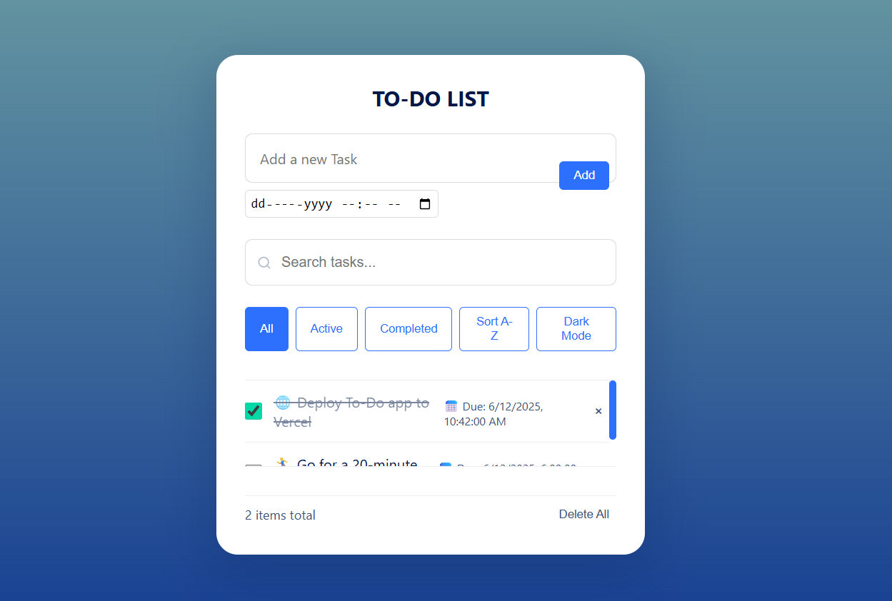
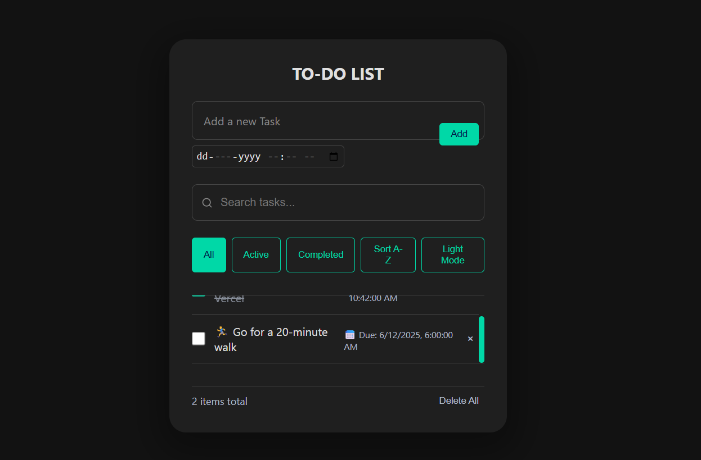

# 📝 To-Do List Web App

A clean and responsive To-Do List app built with **HTML, CSS, and JavaScript** — no frameworks or libraries. Easily manage your tasks with features like filtering, sorting, dark mode, and search highlighting. Simple yet powerful.

---

## 🚀 Features

- ✅ Add tasks with optional due date
- 🖊️ Edit and delete tasks
- 🔍 Search with real-time filtering and clear button
- 🗂️ Filter by All / Active / Completed
- 🔃 Sort tasks alphabetically (A–Z / Z–A)
- 🌙 Dark mode toggle
- 🧮 Task counter and "Delete All" option
- 💾 Tasks saved in `localStorage` for persistence

---

## 📸 Preview

<!-- Replace with actual screenshots if available -->
<p align="center">
  
  
</p>

---

## 📁 Folder Structure

```

.
├── css/
│   └── style.css
├── js/
│   └── script.js
├── index.html
├── assets/
│   └── \[screenshots, icons, etc.]
└── README.md

````

---

## 💻 How to Run

1. **Clone the repository**  
   ```bash
   git clone https://github.com/gauravslnk/to-do-list.git
   cd to-do-list

2. **Open the app**
   Open `index.html` in your browser. No setup required.

---

## 🛠️ Built With

* HTML5
* CSS3
* JavaScript (Vanilla JS)

---

## 🤝 Contributing

Pull requests are welcome! If you'd like to add features or fix bugs, feel free to fork the repo and open a PR.

---

## 📜 License

This project is licensed under the [MIT License](LICENSE).

---

## 🙋‍♂️ Author

**Gaurav Solanki**
🔗 [GitHub](https://github.com/gauravslnk)

---

> Simple. Fast. Offline-friendly. Just get things done.

